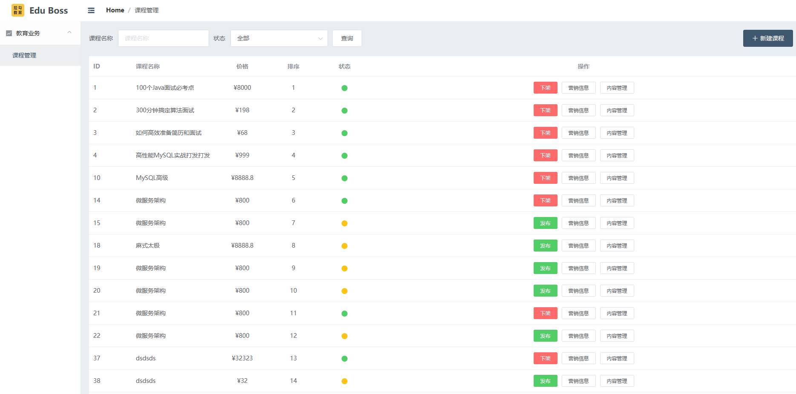

# 拉勾教育课程管理系统（课程管理后台模块） 前端

对应的 JavaWeb 项目后端单体架构项目地址：https://github.com/yumengmeng92/lagou_edu_home


```shell
# Project setup
npm install
# Compiles and hot-reloads for development
npm run serve
# Compiles and minifies for production
npm run build
# Lints and fixes files
npm run lint
# E2E and Unit tests
npm run test

# Customize configuration
See [Configuration Reference](https://cli.vuejs.org/config/).
```

# 笔记

# 幂等性

## 业界最佳实践

    幂等不修改服务器状态用户GET
    幂等修改服务器状态用户GET
    不幂等修改服务器状态用户POST

## 幂等性概念

一个幂等操作的特点是其任意多次执行所产生的影响均与一次执行的影响相同。幂等函数，或幂等方法，
是指可以使用相同参数重复执行，并能获得相同结果的函数。这些函数不会影响系统状态，也不用担心重复执行会对系统造成改变。

## 有状态服务和无状态服务定义

无状态服务：就是没有特殊状态的服务,各个请求对于服务器来说统一无差别处理,请求自身携带了所有服务端所需要的所有参数(服务端自身不存储跟请求相关的任何数据,不包括数据库存储信息)  
有状态服务：与之相反,有状态服务在服务端保留之前请求的信息,用以处理当前请求,比如 session 等

# 警告

```
TypeScript intellisense is disabled on template. To enable, configure `"jsx": "preserve"` in the `"compilerOptions"` property of tsconfig or jsconfig. To disable this prompt instead, configure `"experimentalDisableTemplateSupport": true` in `"vueCompilerOptions"` property.

```

jsconfig.json

```
  "compilerOptions": {
    "target": "es5",
    "module": "esnext",
    "baseUrl": "./",
    "jsx": "preserve",	//在这里添加"jsx": "preserve",
    "moduleResolution": "node",
    "paths": {
      "@/*": [
        "src/*"
      ]
    },
    "lib": [
      "esnext",
      "dom",
      "dom.iterable",
      "scripthost"
    ]
  }
}

```
